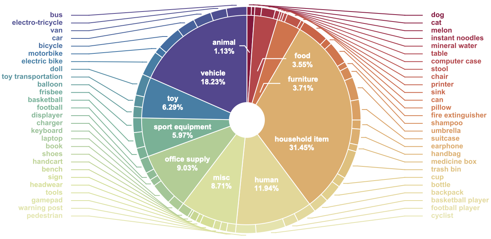
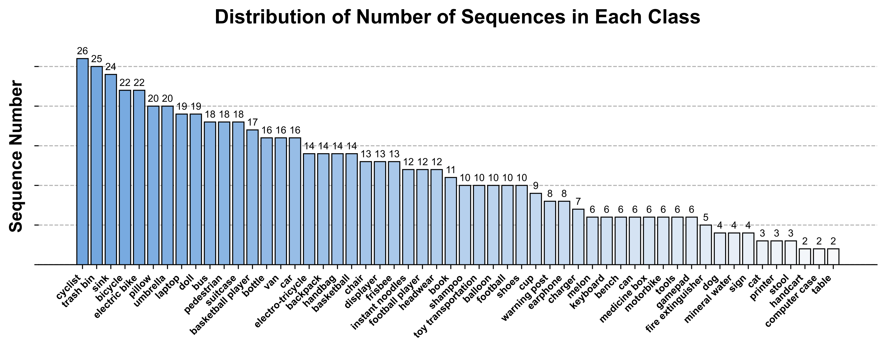
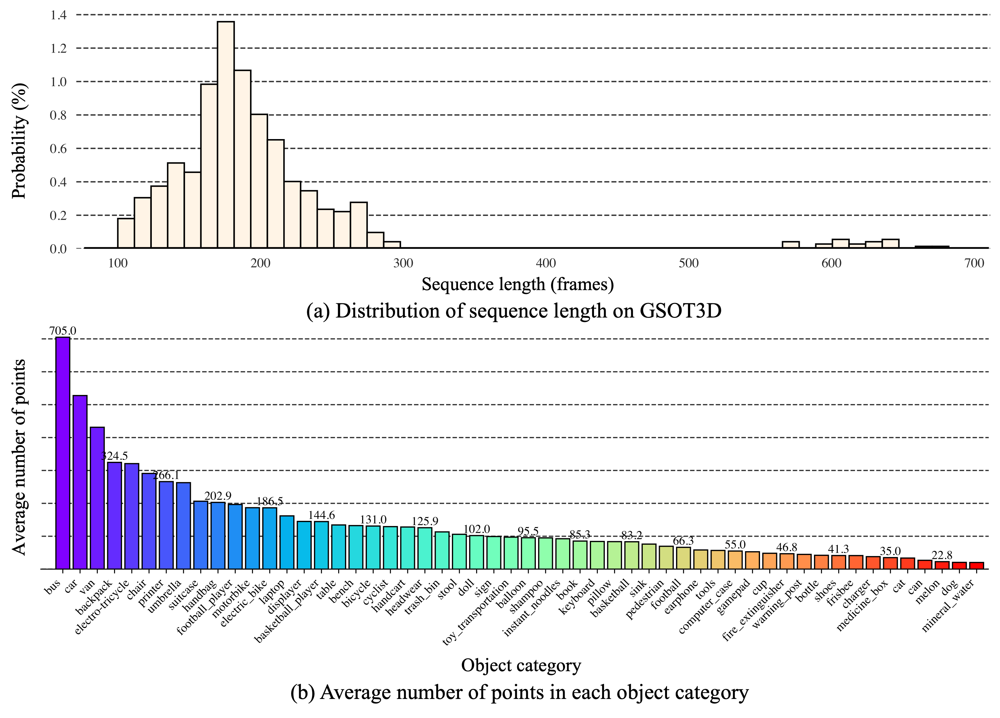
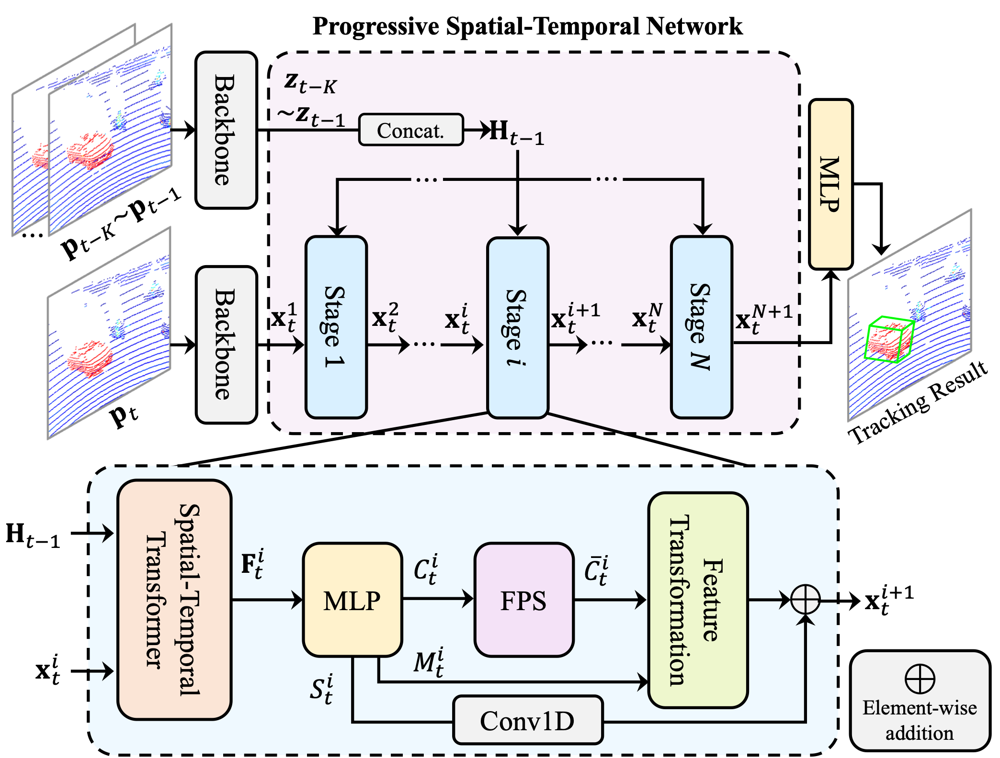
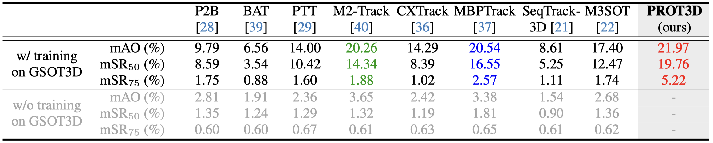
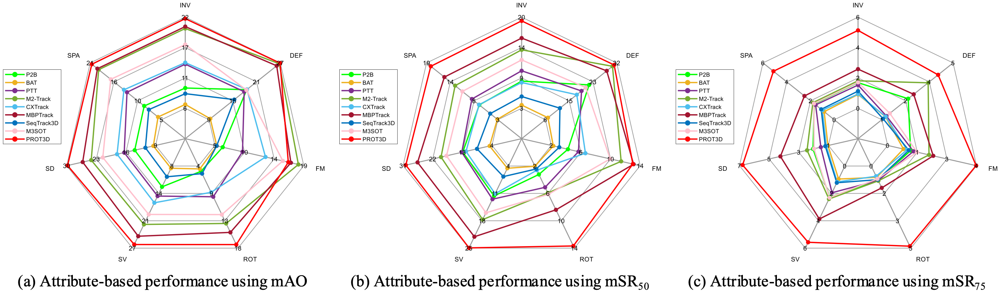
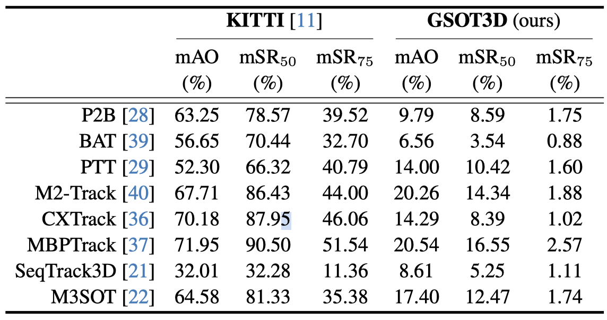
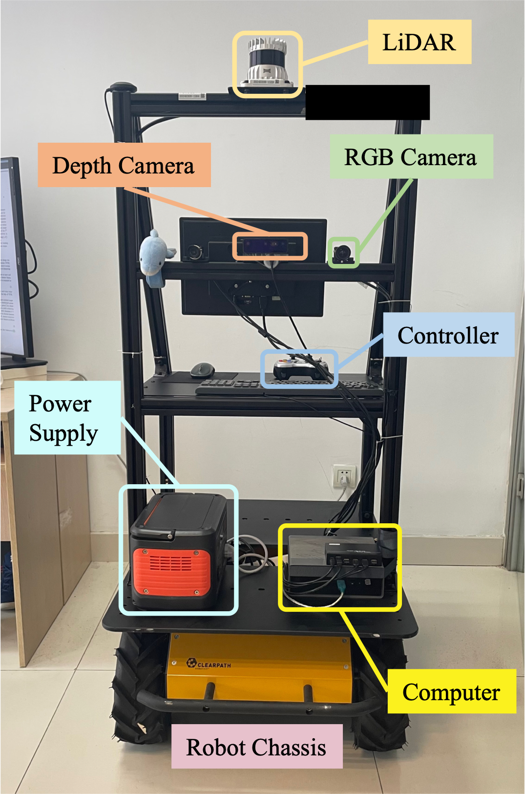
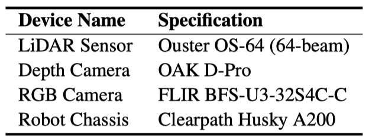

# <p align="center"><small>GSOT3D: Hacia el Seguimiento Genérico de Objeto Único 3D en Escenarios Abiertos</small></p>

[**GSOT3D: Hacia el Seguimiento Genérico de Objeto Único 3D en Escenarios Abiertos**](https://arxiv.org/abs/2412.02129)<br>
Yifan Jiao, Yunhao Li, Junhua Ding, Qing Yang, Song Fu, Heng Fan<sup>$\dagger$</sup>, Libo Zhang<sup>$\dagger$</sup> <br> ($\dagger$: Coautores últimos y asesores con contribución igual)<br>

[](https://arxiv.org/abs/2412.02129)  [](https://creativecommons.org/licenses/by-sa/4.0/)
<!-- [](https://hits.seeyoufarm.com) -->
<!-- [](https://arxiv.org/abs/2412.02129) -->

## :boom: Novedades
- **[2025/10/28]** :speech_balloon: El kit de evaluación ahora está disponible en [GSOT3D-Eval-Metrics](https://github.com/ailovejinx/GSOT3D-Eval-Metrics).
- **[2025/07/15]** :blush: El código de PROT3D ya está disponible.
- **[2025/06/30]** :bar_chart: Nuestro GSOT3D ahora es accesible en 🤗[HuggingFace](https://huggingface.co/datasets/Ailovejinx/GSOT3D) y [BaiduNetDisk (Código de descarga: gsot)](https://pan.baidu.com/s/1sWttodkYyhL_pxZ53d-QVQ).
- **[2025/06/26]** :tada: ¡GSOT3D ha sido aceptado por **ICCV 2025**!

## :dolphin: Referencia GSOT3D
<p align="center">

</p>

**Figura:** Presentamos una nueva referencia, [**GSOT3D**](https://arxiv.org/abs/2412.02129), que tiene como objetivo facilitar el desarrollo del seguimiento genérico de objeto único (SOT) 3D en escenarios abiertos. Específicamente, GSOT3D ofrece **620** secuencias con **123K** fotogramas, y abarca una amplia selección de **54** categorías de objetos. Cada secuencia se proporciona con **múltiples modalidades**, incluyendo **la nube de puntos (PC)**, **imagen RGB** y **profundidad**. Esto permite que GSOT3D soporte diversas tareas de seguimiento 3D, como el SOT 3D unimodal en PC y el SOT 3D multimodal en RGB-PC o RGB-D, ampliando así enormemente las direcciones de investigación para el seguimiento de objetos 3D. 

### :sparkles: Aspectos Destacados

* **Múltiples Modalidades**
    - GSOT3D proporciona **múltiples modalidades** para cada secuencia, incluyendo **nube de puntos (PC)**, **imagen RGB** y **profundidad**, lo que lo convierte en una plataforma versátil para diversas direcciones de investigación en seguimiento de objeto único 3D.
* **Diversidad de Categorías de Objetivo**
    - GSOT3D abarca una amplia selección de **54** categorías de objetos, convirtiéndolo en una referencia **diversa** para el seguimiento de objeto único 3D.
* **Referencia a Mayor Escala**
    - GSOT3D comprende **620** secuencias con **123K** fotogramas, siendo la referencia **más grande** diseñada cuidadosamente para el seguimiento de objeto único 3D.
* **Caja 9-DoF (Grados de Libertad)**
    - A diferencia de Nuscenes y KITTI, GSOT3D proporciona cajas delimitadoras **9-DoF** para cada objeto, lo cual es más **integral** y **realista** para el seguimiento de objeto único 3D.
* **Anotación de Alta Calidad y Densa**
    - Para anotaciones densas y precisas, todas las secuencias en GSOT3D están **etiquetadas manualmente** utilizando cajas delimitadoras 3D de 9DoF con **múltiples rondas de inspección y refinamiento**.
### :100: Estadísticas de GSOT3D
<p align="center">

</p>

<p align="center">

</p>

**Figura:** Ilustración de la organización de categorías en GSOT3D y su distribución de número de secuencias en cada clase.

<p align="center">

</p>

**Figura:** Estadísticas de GSOT3D. (a): Distribución de la longitud de la secuencia. (b): Número promedio de puntos en cada categoría de objeto.

## :shark: Marco de Trabajo PROT3D
<p align="center">
  
</p>

**Figura:** Para facilitar la investigación en GSOT3D, presentamos un seguidor 3D genérico sencillo pero efectivo, denominado **PROT3D**, para el seguimiento 3D independiente de la clase en nubes de puntos. El núcleo de PROT3D es una arquitectura espacio-temporal progresiva que contiene múltiples etapas. En cada etapa, la localización del objetivo se realiza mediante emparejamiento espacio-temporal con Transformer, y el resultado se aplica para refinar la característica de la región de búsqueda. La característica refinada de la región de búsqueda de una etapa se transmite a la siguiente para mayores mejoras, y el resultado de seguimiento se genera después de la etapa final.

## :triangular_flag_on_post: Evaluación por Referencia
### :yellow_heart: Rendimiento General de Ocho Seguidores SOTA

<p align="center">

</p>

**Tabla:** Rendimiento general de ocho seguidores de vanguardia y nuestro **PROT3D** utilizando mAO, mSR<sub>50</sub> y mSR<sub>75</sub>. Los tres mejores resultados se resaltan en fuentes de color <span style="color: red;">rojo</span>, <span style="color: blue;">azul</span> y <span style="color: green;">verde</span>, respectivamente.

### :yellow_heart: Evaluación Basada en Atributos
<p align="center">

</p>

**Figura:** Rendimiento basado en atributos y comparación utilizando mAO, mSR<sub>50</sub> y mSR<sub>75</sub>.

### :yellow_heart: Comparación con Otras Referencias
<p align="center">

</p>

**Tabla:** Comparación de GSOT3D con KITTI.

### :yellow_heart: Ejemplos de GSOT3D
<p align="center">

</p>

**Figura:** Visualización de la verdad terrestre (ground truth) y varios resultados de seguimiento en GSOT3D.


**Se pueden encontrar más resultados experimentales con análisis en el [artículo](https://arxiv.org/abs/2412.02129).**

## :robot: Plataforma de Adquisición de Datos

<p align="center">

</p>

**Figura:** Para recopilar datos multimodales para GSOT3D, construimos **una plataforma robótica móvil** basada en Clearpath Husky A200. Varios sensores, incluyendo un LiDAR de 64 haces, una cámara RGB y una cámara de profundidad, se despliegan en la plataforma con una cuidadosa calibración.

<p align="center">

</p>

**Tabla:** Configuración específica de los sensores y el chasis robótico de la plataforma robótica móvil.

## :rocket: Descarga de GSOT3D

Nuestro GSOT3D ahora es accesible en 🤗[HuggingFace](https://huggingface.co/datasets/Ailovejinx/GSOT3D) y [BaiduNetDisk (Código de descarga: gsot)](https://pan.baidu.com/s/1sWttodkYyhL_pxZ53d-QVQ).

Tamaño total de GSOT3D: **~315GB**

Si encuentras algún problema con el enlace de descarga, no dudes en abrir un issue o contactarnos a través de `jiaoyifan23@mails.ucas.ac.cn`.

## :memo: Uso Responsable de GSOT3D
GSOT3D tiene como objetivo facilitar la investigación y las aplicaciones de seguimiento de objeto único 3D. Se desarrolla y utiliza con **fines exclusivamente de investigación**.

## :gun: Línea Base PROT3D

### Preparación

Aquí listamos las partes más importantes de nuestras dependencias

```
Las siguientes dependencias han sido probadas en: 
  SO: Ubuntu 20.04.2 LTS x86_64
  CUDA: 11.1
  Python: 3.8.10
  Pytorch: 1.8.1+cu111
  
  GPU: NVIDIA GeForce RTX 3090 x8
  CPU: Intel Xeon Platinum 8153 (64) @ 2.800GHz
```

| Dependencia         | Versión     |
|-------------------|-------------|
| open3d            | 0.18.0      |
| pointnet2-ops     | 3.0.0       |
| pytorch           | 1.8.1+cu111 |
| pytorch-lightning | 1.6.0       |
| pytorch3d         | 0.6.0       |
| shapely           | 1.7.1       |
| torchvision       | 0.9.1+cu111 |


#### Instalar paquete conda.
```shell
cd ${path/to/GSOT3D}$
conda env create -f freeze.yml && conda activate prot3d

# asegúrate de que tu versión de torch sea la versión GPU y coincida con tu versión de CUDA
# por ejemplo, si tu versión de CUDA es 11.1, puedes instalar torch 1.8.1 de la siguiente manera
pip install torch==1.8.1+cu111 torchvision==0.9.1+cu111 torchaudio==0.8.1 -f https://download.pytorch.org/whl/torch_stable.html

# instala pointnet2_ops y pytorch3d
cd ./dep_libs/pointnet2_ops_lib && pip install -e .
cd ../pytorch3d-0.6.0 && pip install -e .

```

#### Preparar Conjuntos de Datos
##### KITTI

- Descarga los datos de [velodyne](http://www.cvlibs.net/download.php?file=data_tracking_velodyne.zip), [calib](http://www.cvlibs.net/download.php?file=data_tracking_calib.zip) y [label_02](http://www.cvlibs.net/download.php?file=data_tracking_label_2.zip) desde [KITTI Tracking](http://www.cvlibs.net/datasets/kitti/eval_tracking.php).

- Descomprime los archivos descargados.

- Coloca los archivos descomprimidos en la misma carpeta de la siguiente manera:

  ```
  [Carpeta Principal]
  --> [calib]
      --> {0000-0020}.txt
  --> [label_02]
      --> {0000-0020}.txt
  --> [velodyne]
      --> Carpetas [0000-0020] con archivos .bin de velodyne
  ```

##### GSOT3D

1. Descarga GSOT3D desde HuggingFace o BaiduNetDisk utilizando el enlace anterior.
2. Descomprime los archivos `*.tar.gz` en `./sequences` en la carpeta `./data`.
3. Organiza el conjunto de datos según la siguiente estructura:
```
gsot3d
├── data
|   ├── Seq_00001
│       ├── calib.json
│       ├── camera_image_0
│           ├── 00001.jpg
|           ···
│       ├── camera_image_1
│           ├── 00001.jpg
|           ···
│       ├── camera_image_2
│           ├── 00001.jpg
|           ···
│       ├── camera_image_3
│           ├── 00001.jpg
|           ···
│       ├── gt.txt
│       ├── lidar_point_cloud_0
│           ├── 00001.pcd
|           ···
│       └── point_cloud_bin
│           ├── 00001.bin
|           ···
|   ├── Seq_00002
|       ···
|   ···
│   └── Seq_00650
├── symmetric.txt
├── test_set.txt
└── train_set.txt
```

### Entrenamiento

Para entrenar PROT3D en GSOT3D, puedes ejecutar el siguiente comando:

```bash
# admite DDP, usa 8 GPUs
python main.py configs/prot_gsot3d_all_cfg.yaml --run_name prot3d_gsot3d --gpus 0 1 2 3 4 5 6 7
```

### Pruebas
```bash
# cargar checkpoint y evaluar
python main.py configs/prot_gsot3d_all_cfg.yaml --gpus 4 --phase test --resume_from ${path/to/checkpoint}
```

### Evaluación
TODO

### Agradecimientos

Nuestro PROT3D se construye en gran medida sobre [Open3DSOT](https://github.com/Ghostish/Open3DSOT) y [MBPTrack](https://github.com/slothfulxtx/MBPTrack3D). Agradecemos a los autores por su excelente trabajo y por publicar su código de forma abierta.

Para más detalles, puedes consultar Open3DSOT y MBPTrack.

## :balloon: Citación
Si encuentras útil nuestro GSOT3D, por favor considera darle una estrella y citarlo. ¡Gracias!
```
@article{jiao2024gsot3d,
  title={GSOT3D: Towards Generic 3D Single Object Tracking in the Wild},
  author={Yifan, Jiao and Yunhao, Li and Junhua, Ding and Qing, Yang and Song, Fu and Heng, Fan and Libo, Zhang},
  journal={arXiv preprint arXiv:2412.02129},
  year={2024}
}
```
