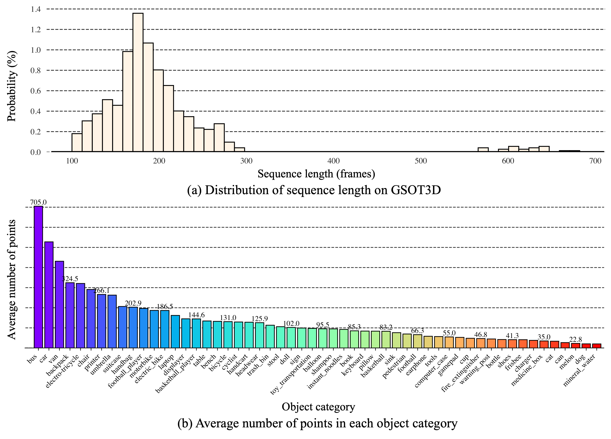

# <p align="center"><small>GSOT3D: Towards Generic 3D Single Object Tracking in the Wild</small></p>

[**GSOT3D: Towards Generic 3D Single Object Tracking in the Wild**](https://arxiv.org/abs/2412.02129)<br>
Yifan Jiao, Yunhao Li, Junhua Ding, Qing Yang, Song Fu, Heng Fan<sup>$\dagger$</sup>, Libo Zhang<sup>$\dagger$</sup> <br> ($\dagger$: Equal advising and co-last authors)<br>

[](https://arxiv.org/abs/2412.02129)  [](https://creativecommons.org/licenses/by-sa/4.0/)  [](https://hits.seeyoufarm.com)
<!-- [](https://arxiv.org/abs/2412.02129) -->

## :dolphin: GSOT3D Benchmark
<p align="center">

</p>

**Figure:** We present a novel benchmark, [**GSOT3D**](https://arxiv.org/abs/2403.03493), that aims at facilitating development of generic 3D single object tracking (SOT) in the wild. Specifically, GSOT3D offers **620** sequences with **123K** frames, and covers a wide selection of **54** object categories. Each sequence is offered with **multiple modalities**, including **the point cloud (PC)**, **RGB image**, and **depth**. This allows GSOT3D to support various 3D tracking tasks, such as single-modal 3D SOT on PC and multi-modal 3D SOT on RGB-PC or RGB-D, and thus greatly broadens research directions for 3D object tracking. 

### :sparkles: Highlights

* **Multiple Modalities**
    - GSOT3D provides **multiple modalities** for each sequence, including **point cloud (PC)**, **RGB image**, and **depth**, making it a versatile platform for various research directions in 3D single object tracking.
* **Target Category Diversity**
    - GSOT3D covers a wide selection of **54** object categories, making it a **diverse** benchmark for 3D single object tracking.
* **Larger-scale Benchmark**
    - GSOT3D comprises **620** sequences with **123K** frames, which is the **largest** benchmark delicately designed for 3D single object tracking.
* **9-DoF (Degrees of Freedom) Box**
    - Different from Nuscenes and KITTI, GSOT3D provides **9-DoF** bounding boxes for each object, which is more **comprehensive** and **realistic** for 3D single object tracking.
* **High-quality and Dense Annotation**
    - For precise dense annotations, all the sequences in GSOT3D are **manually labeled** using 9DoF 3D bounding boxes with **multiple rounds of inspection and refinement**.
### :100: Statistics of GSOT3D
<p align="center">

</p>

<p align="center">

</p>

**Figure:** Illustration of category organization in GSOT3D and its distribution of sequence number in each classes.

<p align="center">

</p>

**Figure:** Statistics on GSOT3D. (a): Distribution of sequence length. (b): Average number of points in each object category

## :shark: PROT3D Framework
<p align="center">
  
</p>

**Figure:** To facilitate research on GSOT3D, we present a simple but effective generic 3D tracker, dubbed **PROT3D**, for class-agnostic 3D tracking on point clouds. The core of PROT3D is a progressive spatial-temporal architecture containing multiple stages. In each stage, target localization is performed by spatial-temporal matching with Transformer, and the result is applied to refine search region feature. The refined search region feature from one stage is forwarded to next stage for further improvements, and tracking result is generated after the final stage.

## :triangular_flag_on_post: Benchmarking
### :yellow_heart: Overall Performance of Eight SOTA Trackers

<p align="center">

</p>

**Table:** Overall performance of eight state-of-the-art trackers and our **PROT3D** using mAO, mSR<sub>50</sub> and mSR<sub>75</sub>. The best three results are highlighted in <span style="color: red;">red</span>, <span style="color: blue;">blue</span>, and <span style="color: green;">green</span> fonts, respectively.

### :yellow_heart: Attribute-based Evaluation
<p align="center">

</p>

**Figure:** Attribute-based performance and comparison using mAO, mSR<sub>50</sub> and mSR<sub>75</sub>.

### :yellow_heart: Attribute-based Evaluation
<p align="center">

</p>

**Table:** Comparison of GSOT3D with KITTI.

### :yellow_heart: Examples of GSOT3D
<p align="center">

</p>

**Figure:** Visualization of ground truth and several tracking results on GSOT3D.


**More experimental results with analysis can be found in the [paper](https://arxiv.org/abs/2412.02129).**

## :robot: Data Acquisition Platform

<p align="center">

</p>

**Figure:** To collect multimodal data for GSOT3D, we build **a mobile robotic platform** based on Clearpath Husky A200. Multiple sensors, including a 64-beam LiDAR, an RGB camera and a depth camera, are deployed on the platform with careful calibration.

<p align="center">

</p>

**Table:** Specific configuration of sensors and robot chassis of the mobile robotic platform.

## :rocket: Download GSOT3D

We will release all download links and models soon. Stay tuned!

## :memo: Responsible Usage of GSOT3D
GSOT3D aims to facilitate research and applications of 3D single object tracking. It is developed and used for **research purpose only**.

## :balloon: Citation
If you find our GSOT3D useful, please consider giving it a star and citing it. Thanks!
```
@article{jiao2024gsot3d,
  title={GSOT3D: Towards Generic 3D Single Object Tracking in the Wild},
  author={Yifan, Jiao and Yunhao, Li and Junhua, Ding and Qing, Yang and Song, Fu and Heng, Fan and Libo, Zhang},
  journal={arXiv preprint arXiv:2412.02129},
  year={2024}
}
```